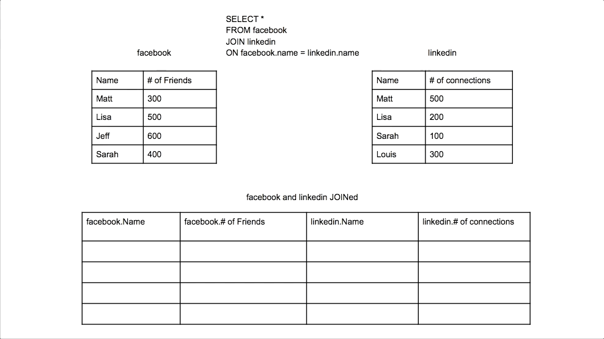

# MySQL Notes

Notes from Colt Steele's MySQL Bootcamp.

## What is a Database?

A database is (1) a collection of data and (2) contains a method for accessing and manipulating that data. In other words, it's a structured set of computerized data with an accessible interface.

A Database Management System is the programme that lets you interface with the data in your database, for example PostgreSQL, MySQL, Oracle Database, SQLite.

## MySQL vs SQL

SQL (Structrured Query Language) is the language you use to talk to your database.

Working with MySQL is primarily writing SQL.

SQL is the [standard language](https://www.iso.org/standard/63555.html) that multiple database management systems implement.

```SQL
SELECT * FROM Users WHERE Age >= 18;
```

What makes database management systems unique are the features they offer, not the language.

## Creating Databases

```SQL
CREATE DATABASE database_name;
```

### Dropping Databases

```SQL
DROP DATABASE database_name;
```

### Using Databases

In MySQl the `USE` command specifies which database you want to work with.

```SQL
USE database_name;
```

`SELECT database();` shows you the currently used database.

### Tables

Tables are the heart of SQL. A relational database is just a bunch of tables.

Tables are a collection of related data held in a structured format within a database.

Within tables, columns act as headers, rows contain the actual data.

### Data Types

When you create a new table you need to specify what data types its columns will contain. You cannot have inconsistent data types, for example strings and numbers mixed.

There are many data types in SQL. You'll use a subset based on your needs, which will change over time.

`INT` represents a whole number (up to a max value of 2147483647). `INT`s can be negative or 0.

`VARCHAR` represents a variable-length string between 1 and 255 characters.

### Creating Tables

```SQL
CREATE TABLE table_name
(
  column_name data_type,
  column_name data_type
);
```

```SQL
SHOW TABLES;
```

```SQL
SHOW COLUMNS FROM table_name;
```

or (though they are technically different)

```SQL
DESC table_name;
```

### Deleting Tables

```SQL
DROP TABLE table_name;
```

## Inserting Data into Tables

```SQL
INSERT INTO table_name (col_1, col_2)
VALUES  (val_1, val_2),
        (val_3, val_4),
        (val_5, val_6);
```

### MySQL Warnings

If you try to insert data that defies the data type or limits for a column, you'll get a warning. To see a list of them, use:

```SQL
SHOW WARNINGS;
```

### NULL and NOT_NULL

`NULL` indicates an unknown value. It does not mean zero.

You can require values by specifying that a field is `NOT NULL`.

### Setting Deafult Values

```SQL
CREATE TABLE table_name (
  name VARCHAR(50) DEFAULT 'No name provided',
  age INT DEFAULT 21
);
```

You can combine `NOT NULL` and `DEFAULT` to prevent `NULL` being deliberately inserted.

### Primary Keys

Each record needs to be uniquely identifiable. The easiest way to do this is to assign an ID.

A Primary Key is a unique identifier on a row.

```SQL
CREATE TABLE unique_cats (
  cat_id INT NOT NULL AUTO_INCREMENT,
  name VARCHAR(100),
  age INT,
  PRIMARY KEY (cat_id)
  );
```

## CRUD Commands

- CREATE - `INSERT INTO ...`

- READ - `SELECT ... FROM ...`

- UPDATE - `UPDATE ... SET ... WHERE ...`

- DELETE - `DELETE FROM ... WHERE ...`

### WHERE Clause

```SQL
SELECT * FROM cats WHERE age = 4;
```

By default the `WHERE` clause is case insensitive.

### Aliases

Aliases can make your results easier to read.

```SQL
SELECT name AS cat_name FROM cats;
```

### Updating

When updating, use `SELECT` first to make sure you're targeting the right data.

### Deleting

`DELETE FROM table_name` will delete all the contents of the table, unlike `DROP TABLE table_name` which will delete the table itself.

## String Functions

String functions allow you to alter how you print out your data. They do not change the data in the database.

### Executing SQL files

`source path_to_file/file_name.sql`

### CONCAT

`CONCAT` lets you combine data for cleaner output.

```sql
CONCAT (column, 'text', anotherColumn, 'more text')

SELECT CONCAT (author_fname, ' ', author_lname) AS full_name FROM books;
```

`CONCAT_WS` stands for Concat with Seperator, which is useful when you are concatenating multiple fields together with the same symbol.

```sql
SELECT CONCAT_WS(' - ', title, author_fname, author_lname) FROM books;
```

### SUBSTRING

`SUBSTRING` (or `SUBSTR`) lets you select individual parts of a string.

You can set a start and end index. If you don't provide an end index, it will include the remainder of the string. If you provide a negative index, it will count back from the end of the string.

**MySQL indexes from 1, not 0.**

```sql
SELECT SUBSTRING ('Hello World', 1, 4);
-- Hell

SELECT SUBSTRING ('Hello World', 7;
-- World

SELECT SUBSTRING('Hello World', -3);
-- rld

SELECT SUBSTRING(title, 1, 10) AS 'short title' FROM books;
```

### REPLACE

`REPLACE` replaces parts of a string. It is case sensitive.

```sql
SELECT REPLACE('Hello World', 'Hell', '%$#@');
-- %$#@o World

SELECT REPLACE('cheese bread coffee milk', ' ', ' and ');
-- cheese and bread and coffee and milk
```

### REVERSE

`REVERSE` lets you reverse a string.

```sql
SELECT REVERSE('Hello World');
-- dlroW olleH
```

### CHAR_LENGTH

`CHAR_LENGTH` counts the characters in a given string.

```sql
SELECT CHAR_LENGTH('Hello World');
-- 11

SELECT
  CONCAT(author_lname, ' is ', CHAR_LENGTH(author_lname), ' characters long')
FROM books;
```

### UPPER and LOWER

`UPPER` and `LOWER` will change a string's case.

```sql
SELECT UPPER('Hello World');
-- HELLO WORLD

SELECT LOWER('Hello World');
-- hello world
```

You can combine string functions. The inner function will be evaluated first.

```sql
SELECT
  CONCAT(SUBSTRING(title, 1, 10), '...') AS 'short title'
FROM books;
```

But keep in mind how many arguments a string function expects. For example, `CONCAT` expects two arguments.

```sql
✅ SELECT UPPER(CONCAT(author_fname, ' ', author_lname)) AS "full name in caps" FROM books; -- This works

❌ SELECT CONCAT(UPPER(author_fname, ' ', author_lname)) AS "full name in caps" FROM books; -- This doesn't work
```

## Refining Selections

### DISTINCT

`DISTINCT` is used in conjunction with `SELECT` to exclude duplicate results.

```sql
SELECT DISTINCT author_lname FROM books;
```

You can apply `DISTINCT` to a combination of values.

```sql
SELECT DISTINCT author_fname, author_lname FROM books;
```

### ORDER BY

`ORDER BY` lets you sort your results.

```sql
SELECT author_lname FROM books ORDER BY author_lname;
```

By default, it is in ascending alphanumeric order. You can specify if you want ascending or descending order with `ASC` or `DESC`.

```sql
SELECT author_lname FROM books ORDER BY author_lname DESC;
```

If you are selecting multiple fields you can specify which field to sort by with its number.

```sql
-- order by author_fname
SELECT title, author_fname, author_lname FROM books ORDER BY 2;
```

You can order by two different columns, though you won't very often. It will use the second column if there are any conflicts.

```sql
SELECT author_fname, author_lname FROM books ORDER BY author_lname, author_fname;
```

### LIMIT

`LIMIT` lets you specify a number for how many results you want to select. It's often used in conjunction with `ORDER BY`.

You can use a comma-seperated list to specify a starting point and limit (which could be useful for pagination). If you want to select all rows from a certain point to the end of the table you'll have to do this.

```sql
SELECT title, released_year FROM books ORDER BY released_year LIMIT 5;

-- skip 10 rows, return 15 rows
SELECT title, released_year FROM books ORDER BY released_year DESC LIMIT 10, 15;
```

### LIKE

`LIKE` allows for fuzzier searching than `WHERE`.

It's case-insensitive, `%` serves as a wildcard for any characters, and `_` serves as a wildcard to specify exactly one character.

If you're searching for a field with '%' or '\_' in it, you escape it with a \, `%\%%`.

```sql
-- returns where title is: anything da anything
SELECT * from books WHERE author_fname LIKE '%da%';

-- returns where stock quantity is 4 characters lon
SELECT * from books WHERE stock_quantity LIKE '____';
```

## Aggregate Functions

Aggregate functions let you combine data to get meaning out of it, for example finding totals and averages.

### COUNT

`COUNT` will count whatever you tell it to count.

```sql
-- returns total number of rows
SELECT COUNT(*) FROM books;

-- returns number of distinct first names
SELECT COUNT(DISTINCT author_fname) FROM books;

-- returns total number of unique authors
SELECT COUNT(DISTINCT author_fname, author_lname) FROM books;
```

### GROUP BY

`GROUP BY` summarizes or aggregates identical data into single rows.

For example, you could group books by author and then count how many books each author has written.

```sql
-- groups books by author last name and counts groups
SELECT author_lname, COUNT(*) FROM books GROUP BY author_lname;

-- returns total number of books published per year
SELECT CONCAT('In ', released_year, ' ', COUNT(*), ' book(s) released') AS year FROM books GROUP BY released_year;
```

Note: From MySQL 5.7, `ONLY_FULL_GROUP_BY` mode is enabled by default and a selection will produce an error if the select list, `HAVING` condition, or `ORDER BY` list refer to nonaggregated columns that are neither named in the `GROUP BY` clause nor are functionally dependent on (uniquely determined by) `GROUP BY` columns.

### MIN and MAX

`MIN` and `MAX` help you find minimum and maximum values, on their own or combined with `GROUP BY`.

```sql
-- returns earliest release year
SELECT MIN(released_year) FROM books;

-- returns longest book
SELECT MAX(pages) FROM books;

-- returns title and pagecount of shortest book (subquery)
SELECT title, pages FROM books WHERE pages = (SELECT MIN(pages) FROM books);

-- returns title and pagecount of shortest book (faster)
SELECT title, pages FROM books ORDER BY pages ASC LIMIT 1;
```

Subqueries are a little bit slow since each query is run independently.

```sql
-- returns first year each author was publised
SELECT author_fname, author_lname, MIN(released_year) FROM books GROUP BY author_lname, author_fname;

-- returns longest book for each author
SELECT CONCAT(author_fname, ' ', author_lname) AS author, MAX(pages) AS 'longest book' FROM books GROUP BY author_lname, author_fname;
```

### SUM

`SUM` sums together data.

```sql
-- returns the total number of pages in all books
SELECT SUM(pages) FROM books;

-- returns total pages written by each author
SELECT author_fname, author_lname, SUM(pages) FROM books GROUP BY author_lname, author_fname;
```

### AVG

`AVG` averages data. It will return a decimal to four places from an integer.

```sql
-- returns average release year of all books
SELECT AVG(released_year) FROM books;

-- returns the average stock quantity of books by release year
SELECT released_year, AVG(stock_quantity) FROM books GROUP BY released_year;
```

## Revisiting Data Types

### Storing Text

### VARCHAR and CHAR

`VARCHAR` and `CHAR` both store text.

The length of a `CHAR` column is fixed to the length you declared when you created the table. It can be any value from 0 to 255. When `CHAR` values are stored, they are right-padded with spaces up to the specified length. When `CHAR` values are retrieved, any trailing spaces are removed unless the `PAD_CHAR_TO_FULL_LENGTH` SQL mode is enabled.

`CHAR` is faster for fixed length text, for example: state abbreviations (CA, NY), yes/no flags.

| Value     | Char(4) | Storage | Varchar(4) | Storage |
| --------- | ------- | ------- | ---------- | ------- |
| ''        | ' '     | 4 bytes | ''         | 1 byte  |
| 'ab'      | 'ab '   | 4 bytes | 'ab'       | 3 bytes |
| 'abcd'    | 'abcd'  | 4 bytes | 'abcd'     | 5 bytes |
| 'abcdefg' | 'abcd'  | 4 bytes | 'abcdefg'  | 5 bytes |

### Numbers

### INT

`INT` stores whole numbers.

### DECIMAL

`DECIMAL` can include a decimal point. `DECIMAL` takes precision (total number of digits, up to 65) and scale (digits after decimal, up to 30) values. The scale value can't be bigger than the precision value.

If you try to insert a value greater than the maximum allowed, the largest possible decimal will be inserted.

```sql
-- can store up to 999.99
DECIMAL(5,2)
```

### FLOAT and DOUBLE

While `DECIMAL` is a fixed-point type and calculations are exact, `FLOAT` and `DOUBLE` are floating-point types and calculations are approximate.

`FLOAT` and `DOUBLE` can store larger numbers using less space but it comes at the cost of precision.

| Data Type | Memory Needed | Precision  |
| --------- | ------------- | ---------- |
| FLOAT     | 4 bytes       | ~7 digits  |
| DOUBLE    | 8 bytes       | ~15 digits |

Try to use `DECIMAL` unless precision doesn't matter.

### Dates and Times

### DATE

`DATE` stores a date in the format 'YYYY-MM-DD' with no time specified.

### TIME

`TIME` stores a time in the format 'HH:MM:SS' with no date specified.

### DATETIME

`DATETIME` stores values with both date and time in the format 'YYYY-MM-DD HH:MM:SS'.

Often you'll record the datetime for when a record is created.

```sql
INSERT INTO people (name, birthdate, birthtime, birthdt)
VALUES('Padma', '1983-11-11', '10:07:35', '1983-11-11 10:07:35');
```

### CURDATE

`CURDATE()` gives you the current date.

### CURTIME

`CURTIME()` gives you the current time.

### NOW

`NOW()` gives you the current datetime.

### Formatting Dates

MySQL has several functions for formatting dates, including:

- `DAY()` will extract the day element of a date (1 to 31)
- `DAYNAME()` will return the name of the day (Monday to Sunday)
- `DAYOFWEEK()` will return the number of the day (from 1 (Sunday) to 7 (Saturday))
- `DAYOFYEAR()` will return the day of the year (from 1 to 365)
- `MONTH()` will extract the month from the date (from 1 to 12)
- `MONTHNAME()` will return the name of the month (January to December)

If used on a time rather than a date or datetime, these functions will return NULL.

If working with times or datetimes, you can use:

- `HOUR` will extract the hour from the time (0 to 23)
- `MINUTE` will extract the minute from the time (0 to 59)

### DATE_FORMAT

`DATE_FORMAT` formats the date values according to the format string provided.

```sql
-- return dd/mm/yyyy
SELECT DATE_FORMAT(birthdt, '%m/%d/%Y') FROM people;

SELECT DATE_FORMAT(birthdt, '%m/%d/%Y at %h:%i') FROM people;

-- 'Sunday October 2009'
SELECT DATE_FORMAT('2009-10-04 22:23:00', '%W %M %Y');
```

The format string uses specifiers such as

| Specifier | Description                     |
| --------- | ------------------------------- |
| %i        | Minutes, numeric (00..59)       |
| %H        | Hour (00..23)                   |
| %W        | Weekday name (Sunday..Saturday) |
| %M        | Month name (January..December)  |
| %m        | Month, numeric (00..12)         |
| %Y        | Year, numeric (four digits)     |
| %y        | Year, numeric (two digits)      |

See the [MySQL Docs](https://dev.mysql.com/doc/refman/8.0/en/date-and-time-functions.html#function_date-format) for a full reference.

### Date Maths

There are two main functions for doing calculations around dates.

### DATEDIFF

`DATEDIFF()` takes in two dates (or datetimes), subtracts the second from the first and tells you the number of days between them.

```sql
-- 1
SELECT DATEDIFF('2007-12-31 23:59:59', '2007-12-30');

-- -31
SELECT DATEDIFF('2010-11-30 23:59:59', '2010-12-31');

SELECT DATEDIFF(NOW(), '2020-10-06');
```

### DATEADD

`DATE_ADD()` performs date arithmetic. It takes in a date argument for the starting date/datetime and an interval value. `DATE_SUB()` works in the same way.

You can use +/- as a shorthand.

```sql
-- '2018-05-02'
SELECT DATE_ADD('2018-05-01', INTERVAL 1 DAY);
SELECT '2018-05-01' + INTERVAL 1 DAY;

-- '2017-05-01'
SELECT DATE_SUB('2018-05-01', INTERVAL 1 YEAR);
SELECT '2018-05-01' - INTERVAL 1 YEAR;
```

### Working with TIMESTAMPS

Timestamp is a generic term for storing metadata about when something is created or updated.

In MySQL, `TIMESTAMP` is also a datatype.

Both `DATETIME` and `TIMESTAMP` store date and time information. The main difference is the range of times and dates they support.

`DATETIME` can go back to the year 1000 and up to 9999, `TIMESTAMP` only goes back to 1970 and up to 2038.

`TIMESTAMP` is 4 bytes while `DATETIME` is 8 bytes.

You can set MySQL to update the timestamp for a row whenever the row is changed.

```sql
CREATE TABLE comments(
  content VARCHAR(100)
  changed_at TIMESTAMP DEFAULT NOW() ON UPDATE NOW()
);
```

## Logical Operators

### Not Equal

`!=` lets you query where two values are not equal.

```sql
-- returns books not published in 2017
SELECT title FROM books WHERE year != 2017;
```

### Not Like

`NOT LIKE` is the opposite of `LIKE`. It lets you exclude results based off patterns in strings.

```sql
-- returns books with titles not starting with 'W'
SELECT title FROM books WHERE title NOT LIKE 'W%';
```

### Greater Than

`>` lets you query based off a value being greater than another.

```sql
-- returns books published after 2000
SELECT title FROM books WHERE released_year > 2000;
```

`>=` works the same way, where a value is greater than or equal to another.

```sql
-- returns books with 100 or more in stock
SELECT title, stock_quantity FROM books WHERE stock_quantity >= 100;
```

#### Aside - Boolean logic in MySQL

If you run `SELECT 99 > 1;` you'll get back `1`. MySQL has evaluated the query as true, represented by 1. If the query had evaluated to false, it would return 0.

If you run `SELECT 'a' > 'b';` you'll get 0 as this is false in MySQL.

If you run `SELECT 'A' > 'a';` you'll get 0 as this is also false but `SELECT 'A' >= 'a';` returns 1 since MySQL considers them equivalent.

When you run a query, behind the scenes MySQL is essentially evaluating it against each row and returning that row if the result evaluates as true.

### Less Than

`<` lets you query based off a value being less than another.

```sql
-- returns books published before 2000
SELECT title FROM books WHERE released_year < 2000;
```

### Logical AND

`AND` (or `&&` in MySQL 7 or older) lets you chain together multiple pieces of logic. All conditions need to evaluate to true.

```sql
-- returns books published by David Eggers after 2010
SELECT * FROM books WHERE author_lname = 'Eggers' AND released_year > 2010;
```

### Logical OR

`OR` (or `||` in MySQL 7 or older) lets you return data when at least one condition is true.

```sql
-- returns books published by David Eggers and all books published after 2010
SELECT * FROM books WHERE author_lname = 'Eggers' OR released_year > 2010;
```

### BETWEEN

`BETWEEN` lets you query data based off values between an upper and lower range (inclusive). You can also do this by combining `>=` and `<=`.

```sql
-- returns books published between 2004 and 2015
SELECT title, released_year FROM books WHERE released_year BETWEEN 2004 AND 2015;
```

`NOT BETWEEN` works on the same principal.

```sql
-- returns books published in 2004 or earlier and 2015 or later
SELECT title, released_year FROM books WHERE released_year NOT BETWEEN 2004 AND 2015;
```

MySQL is smart enough to treat strings in date format as dates. For best results, however, when using `BETWEEN` with date and time values, use `CAST()` to make sure they are both the same data type. For example, with a date and a datetime, convert the date into a datetime.

```sql
SELECT CAST('2017-05-02' AS DATETIME);
```

### IN and NOT IN

`IN` lets you check if a given column is in a set of values.

```sql
-- returns books authored by Carver, Lahiri or Smith
SELECT title, author_lname FROM books WHERE author_lname IN ('Carver', 'Lahiri', 'Smith');
```

`NOT IN` lets you check if a value isn't in a set of values.

```sql
-- returns books not authored by Carver, Lahiri or Smith
SELECT title, author_lname FROM books WHERE author_lname NOT IN ('Carver', 'Lahiri', 'Smith');
```

### Modulo

`%` lets you test if a value is evenly divisible. It gives you the remainder after you divide two values.

```sql
-- returns books published after 2000 and not in even numbered years
SELECT title, released_year FROM books WHERE released_year >= 2000 AND released_year % 2 != 0;
```

### Case Statements

Case statements allow you to add conditional logic to your queries.

```sql
-- groups books as GENRE where books published in 2000 or later are 'Modern Lit' and books published earlier are '20th Century Lit'
SELECT title, released_year,
  CASE
    WHEN released_year >= 2000 THEN 'Modern Lit'
    ELSE '20th Century Lit'
  END AS Genre
FROM books;

-- returns graphical indication of stock quantity
SELECT title, stock_quantity
  CASE
    WHEN stock_quantity <= 50 THEN '*'
    WHEN stock_quantity <= 100 THEN '**'
    ELSE '***'
  END AS STOCK
FROM books;
```

## Relationships and Joins

Real world data is messy and interrelated.

Even a simple blog site might have data about users, posts, tags and comments.

With books, you also need to keep track of editions, multiple authors, customers, orders, genres and reviews.

### Types of Relationships

- One to one relationships
- One to many relationships
- Many to many relationships

A one to one relationship might be between a Customers table and a Customer Details table.

A one to many relationship might be between one Book and many Reviews.

A many to many relationship might between Books and Authors.

### One to Many

1:Many is the most common relationship.

A classic example is customers to orders. A customer can have many orders, an order has one customer associated with it.

CUSTOMERS

| customer_id | first_name | last_name | email            |
| ----------- | ---------- | --------- | ---------------- |
| 1           | Boy        | George    | george@gmail.com |
| 2           | George     | Michaela  | gm@gmail.com     |
| 3           | David      | Bowie     | david@gmail.com  |
| 4           | Blue       | Steele    | blue@gmail.com   |

ORDERS

| order_id | order_date   | amount | customer_id |
| -------- | ------------ | ------ | ----------- |
| 1        | '2016-02-10' | 99.99  | 1           |
| 2        | '2017-11-11' | 35.50  | 1           |
| 3        | '2014-12-12' | 800.67 | 2           |
| 4        | '2015-01-03' | 12.50  | 2           |

The **Primary Key** is the unique identifier for a table. In the Customers table, it's customer_id. In the orders table, it's order_id.

**Foreign Keys** are references to another table from within a given table. In the Orders table, it's customer_id.

### Working with Primary and Foreign Keys

When creating tables you add constraints on certain fields to establish that they are a Primary Key (and must be unique) or a Foreign Key (and references the Primary Key of another table).

The convention is to name a Foreign key after the table and column it references, such as customer_id.

```sql
CREATE TABLE customers(
  id INT AUTO_INCREMENT PRIMARY KEY,
  ...
);

CREATE TABLE orders(
  id INT AUTO_INCREMENT PRIMARY KEY,
  ...
  customer_id INT,
  FOREIGN KEY(customer_id) REFERENCES customers(id)
);
```

### Cross Joins

Joins let you join two tables in a number of different configurations.

The most basic join (a cross join) would take every customer and conjoin them with every order.

```sql
SELECT * FROM customers, orders;
```

### Inner Joins

Inner joins let you select all records from table A and table B where the join condition is met. This creates a union table.

You can do this implicitly, but it is standard practice to do it explicitly using `JOIN table_name ... ON condition`.

You can explicitly write `INNER JOIN` but you don't have to.

```sql
-- implicit inner join
SELECT first_name, last_name, order_date, amount FROM customers, orders WHERE customers.id = orders.customer_id;

-- explicit inner join
SELECT first_name, last_name, order_date, amount FROM customers JOIN orders ON customers.id = orders.customer_id;
```

You can still use aggregate functions on the results of a join.

```sql
SELECT first_name, last_name, SUM(amount) AS total_spent
FROM customers
JOIN orders
ON customers.id = orders.customer_id
GROUP BY orders.customer_id
ORDER BY total_spent DESC;
```

### Left Joins

Left joins let you select records from table A along with any matching records from table B.

Where there isn't a match, the value will be `NULL`. You can use `IFNULL(value, replacement)` to replace null values with 0 for example.

```sql
-- left join
SELECT first_name, last_name, order_date, amount
FROM customers
LEFT JOIN orders
    ON customers.id = orders.customer_id
ORDER BY order_date;

-- left join, replace null values
SELECT
    first_name,
    last_name,
    IFNULL(SUM(amount), 0) AS total_spent
FROM customers
LEFT JOIN orders
ON customers.id = orders.customer_id
GROUP BY customers.id
ORDER BY total_spent DESC;
```


Animated visual from The Data School of [how left joins work](https://dataschool.com/how-to-teach-people-sql/left-right-join-animated/).

### Rights Joins

Right joins let you select records from table B along with any matching records from table A.

```sql
-- right join
SELECT first_name, last_name, order_date, amount
FROM customers
RIGHT JOIN orders
    ON customers.id = orders.customer_id
ORDER BY order_date;
```



Animated visual from The Data School of [how left joins work](https://dataschool.com/how-to-teach-people-sql/left-right-join-animated/).

If there's something in the orders table that doesn't have a match in customers, that would mean there is no customer or a wrong id. Here a RIGHT JOIN would uncover the error.

If you try to delete a customer that an order is referencing, you will get an error due to the foreign key constraint.

### On Delete Cascade

If you want to delete a record and have every record that relates to it also be deleted, add `ON DELETE CASCADE` when defining the foreign key.

```sql
CREATE TABLE orders(
  id INT AUTO_INCREMENT PRIMARY KEY,
  ...
  customer_id INT,
  FOREIGN KEY(customer_id)
  REFERENCES customers(id)
  ON DELETE CASCADE
);
```

### Difference between LEFT and RIGHT JOINS

There is not much difference between a `LEFT JOIN` and a `RIGHT JOIN`.

The result will include all rows from one of the joined tables, even if a given row has no match in the other table. The main difference between a `LEFT JOIN` and a `RIGHT JOIN` is whether the left or right table is the one from which you get all rows.
